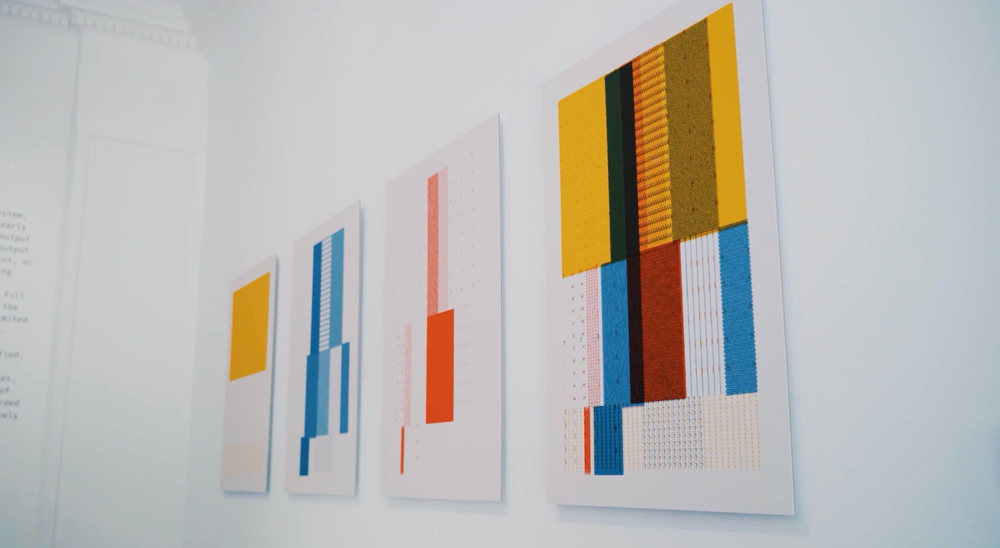
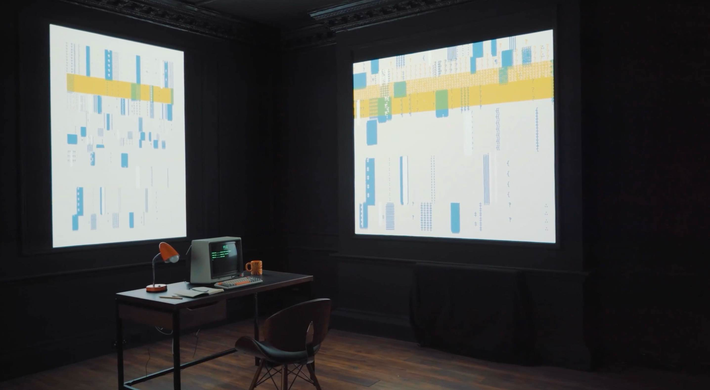
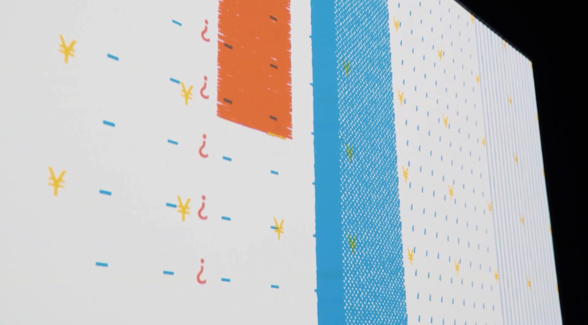
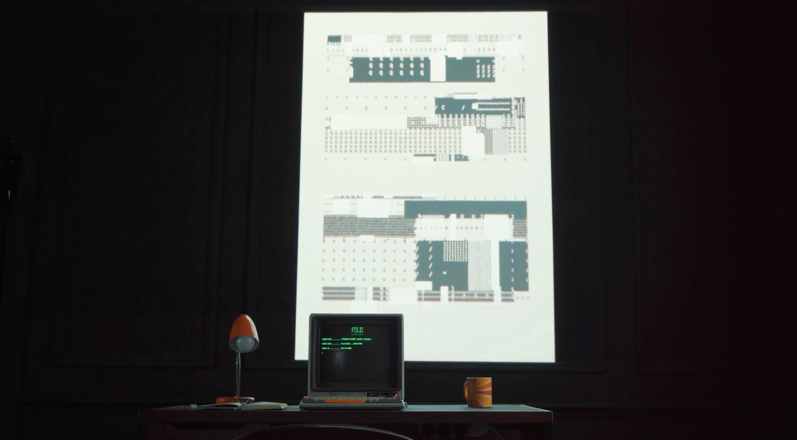

# xilu0335_9103_04
## quiz8
### Imaging Technique Inspiration
My imaging technique of choice is generative art, specifically the use of algorithmically generated dynamic images. This technology is programmed to create complex and unique works of art that respond to user input in real time, enhancing interactivity. I want to incorporate this element of real-time feedback and change into my projects to enhance the user experience and spark creativity. The infinite possibilities of generative art fit my need for interactivity.
[imaging technique](https://vimeo.com/737652098?&signup=true#_=_)

### Coding Technique Exploration
[First technique](https://patatap.com/)
Using jquery, the A-Z,26 letters are bound to keydown keypressed keyup events, and each letter event is individually bound to unique effects and sound effects.

[Second technique](https://patorjk.com/software/taag/#p=display&f=%E5%A4%A7%E9%92%B1&t=Type%20here!)
With jquery, set all the coordinates that make up the edges of the 26 letters in upper and lower case in advance, then fill them in with random keyboard symbols

How to help: Can you bind random but repetitive motion animations or sound effects to different letters to form an aesthetic abstract art animation

