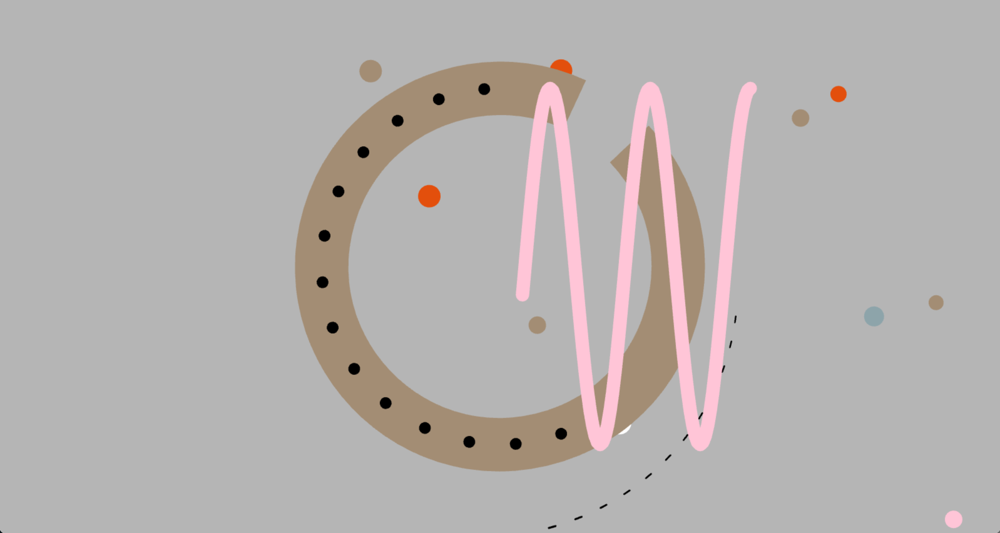

# xilu0335_9103_04
## Quiz8
### 1.Imaging Technique Inspiration
My preferred imaging technique is generative art, which involves the use of dynamic images generated by algorithms. This technology is designed to generate intricate and unique works of art that respond to user input in real time, increasing interactivity. I'd like to include this element of real-time feedback and change into my work to improve the user experience and encourage creativity. The endless possibilities of generative art satisfy my desire for interactivity.
###### Imaging technology screenshot

### 2.Coding Technique Exploration
My coding technique of choice is jQuery, a lightweight JS library.

[First technique](https://patatap.com/)
Using jquery, the A-Z,26 letters are bound to keydown keypressed keyup events, and each letter event is individually bound to unique effects and sound effects.

[Second technique](https://patorjk.com/software/taag/#p=display&f=%E5%A4%A7%E9%92%B1&t=Type%20here!)
With jquery, set all the coordinates that make up the edges of the 26 letters in upper and lower case in advance, then fill them in with random keyboard symbols

How to help:  bind random but repetitive motion animations or sound effects to different letters to form an aesthetic abstract art animation
I can bind randomized but repetitive motion or sound effects to different letters, or arrange the letters according to a certain pattern or compose dynamic effects to form an abstract art animation with an aesthetic sense.

